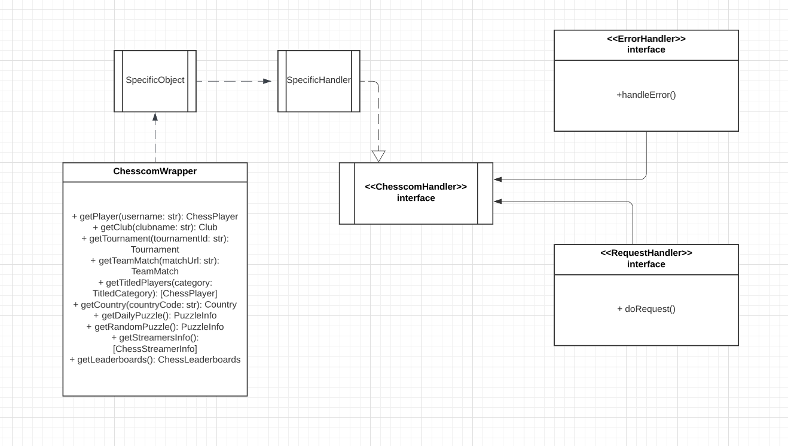

# chesscomwrapper 
This is a wrapper for the chess.com API. **It is a work in progress and is not complete.**

The purpose of this package is to provide a simple way to access the chess.com API. It is not meant to be a complete wrapper for the API, but rather a simple way to access the data you need.

The API is documented here: https://www.chess.com/news/view/published-data-api and it is the source of the data used in this package.

With the public API you can access the following data:
- [Player](#player)
    - Profile ( avatar, player_id, id, url, name, username, followers, country, location, last_online, joined, status, is_streamer, verified, league )
    - Stats ( chess_daily, chess960_daily, chess_rapid, chess_bullet, chess_blitz, fide, tactics, puzzle_rush, puzzle_rush_daily )
    - Games ( url, pgn, time_control, rated, fen, start_time, time_class, rules, white, black, end_time, accuracies, tcn, uuid, initial_setup )
    - Clubs ( name, joined )
    - Tournaments ( finished, inProgress, registered )
- [Club](#club)
    - Profile ( idUrl, name, club_id, country, average_daily_rating, members_count, created, last_activity, admin, visibility, join_request, icon, description, url )
    - Members ( player, joined )
- [Country](#country) ( profile, players, clubs )
- [Daily Puzzle](#dailypuzzle)
- [Random Puzzle](#RandomPuzzle)
- [Streamers Info](#stremersinfo) ( username, avatar, twitch_url, url, is_live, is_community_streamer )
- [Leaderboards](#leaderboards) ( daily, daily960, live_rapid, live_blitz, live_bullet, live_bughouse, live_blitz960, live_threecheck, live_crazyhouse, live_kingofthehill, tactics, rush, battle )
- [Tournament](#tournament)
    - Tournament Round
    - Tournament Round Group
- [Team Match](#teammatch) (board_scores, games)
- [Titled Players](#titledplayers)


## Installation
To install this package, run the following command in your terminal:
`pip install chesscomwrapper`

## Usage
To use this package, import it into your project and create a new instance of the ChesscomWrapper class. You can then use the methods to access the data you need.


### Player
This instance of the Player class will contain the data for the player you requested.
####### Example
```
chesscomWrapper = ChesscomWrapper()
player = chesscomWrapper.getPlayer("nicolapanozzo")

print(player.stats.tactics.highest.rating)

print(player.games[0].pgn)
```
### Club
This instance of the Club class will contain the data for the club you requested.

#### Example
```
chesscomWrapper = ChesscomWrapper()
club = chess_instance.getClub("bonobo")
       
print(club.profile.name)
print(club.profile.average_daily_rating)
```
### Country
This instance of the Country class will contain the data for the country you requested.
####### Example
```
chesscomWrapper = ChesscomWrapper()
country = chess_instance.getCountry("IT")

print(country.players[0].name)
print(country.clubs[0].name)
```
## DailyPuzzle
This instance of the DailyPuzzle class will contain the data for the puzzle of the current day.
#### Example
```
chesscomWrapper = ChesscomWrapper()
dailyPuzzle = chesscomWrapper.getDailyPuzzle()

print(dailyPuzzle.fen)
print(dailyPuzzle.title)
print(dailyPuzzle.image)
```
## RandomPuzzle
This instance of the RandomPuzzle class will contain the data for a random puzzle.
#### Example
```
chesscomWrapper = ChesscomWrapper()
randomPuzzle = chesscomWrapper.getRandomPuzzle()

print(randomPuzzle.title)
```
### StreamersInfo
This instance of the StreamersInfo class will contain the data for the streamers.
#### Example
```
chesscomWrapper = ChesscomWrapper()
streamersInfo = chesscomWrapper.getStreamersInfo()

print(streamersInfo[0].username)
```
### Leaderboards
This instance of the Leaderboards class will contain the data for the leaderboards.
#### Example
```
chesscomWrapper = ChesscomWrapper()
leaderboards = chesscomWrapper.getLeaderboards()

print(leaderboards.daily[0].username)
```
### Tournament
This instance of the Tournament class will contain the data for the tournament you requested.
#### Example
```
chesscomWrapper = ChesscomWrapper()
tournament = chesscomWrapper.getTournament("https://api.chess.com/pub/tournament/-33rd-chesscom-quick-knockouts-1401-1600")

print(tournament.name)
print(tournament.info.creator)
print(tournament.info.players)
```
### TeamMatch
This instance of the TeamMatch class will contain the data for the team match you requested.
#### Example
```
chesscomWrapper = ChesscomWrapper()
teamMatch = chesscomWrapper.getTeamMatch("https://api.chess.com/pub/match/53")

print(team_match.info.teams.team1.name)
```
### TitledPlayers
This instance of the TitledPlayers class will contain the data for the titled players.
#### Example
```
chesscomWrapper = ChesscomWrapper()
titledPlayers = chesscomWrapper.getTitledPlayers(TitledCategory.GM)

print(titledPlayers[0].name)
```

## Advanced Usage
This is a basic UML rapresentation of the package is architectured:

### Handling requests
The API doesn't allow you to make parallel requests, so the wrapper will handle the requests for you to avoid missusages.
But if you want to create your own policy, there are few more tricks you can do with this package. You can handle the requests by yourself implementing a RequestHandler, or the error handling by implementing an ErrorHandler. You can also modify the ChesscomHandler to modify the overall behavior of the requests. **You can also pass a custom RequestHandler to the ChesscomWrapper constructor to handle the requests in a different way**(TODO).

### Laziness behavior
By default, the wrapper will make a request to the API when you call a property, making them lazy. You can pass also the lazy parameter to false to trigger all the needed calls to retrive any information available as soon as the objest is created. If you want to use always fresh data,  use the getter methods to trigger a new request instead of retrive the cached data (e.g. : player._getInfo() instead of player.info).